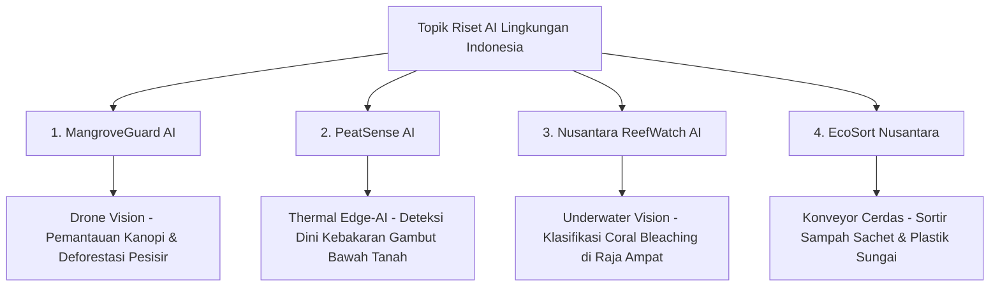

# 🚀 ZAKI AI ACCELERATOR: PERSIAPAN GENIUS OLYMPIAD 2026–2027
### *Jalur Resmi Indonesia (Competzy) ➡️ Menuju Global Finals New York, USA*

[](https://www.python.org/)
[](https://opencv.org/)
[](https://github.com/ultralytics/ultralytics)
[](https://geniusolympiad.org/)

Repository ini dirancang secara terstruktur sebagai kurikulum akselerasi belajar dan riset *Artificial Intelligence (AI)* untuk **Zaki (Usia 13–18 tahun / Siswa Kelas 7–12 SMP–SMA)** dalam mempersiapkan keikutsertaan pada ajang **GENIUS Olympiad - Jalur Indonesia (Competzy)**.

Pemenang final nasional akan diberangkatkan mewakili Indonesia ke panggung **Global Finals di St. John Fisher University, Rochester, New York, Amerika Serikat pada Juni 2027**.

---

## 🚨 PANDUAN KRUSIAL JURI GENIUS OLYMPIAD
> [!IMPORTANT]
> Seluruh kategori di GENIUS Olympiad (termasuk kategori **AI**) memiliki **syarat mutlak: WAJIB memiliki fokus pada isu LINGKUNGAN HIDUP & KEBERLANJUTAN (Environmental & Sustainability Focus)**.
> 
> Proyek AI konvensional seperti absensi wajah sekolah atau chatbot asisten biasa **tidak memenuhi syarat penilaian**. Proyek yang dicari juri adalah AI yang berkontribusi nyata menyelesaikan krisis ekologi (hutan tropis, lahan gambut, sampah perairan, polusi udara, atau keanekaragaman hayati).

---

## 📅 Timeline Kompetisi (Target Utama)

| Agenda | Tanggal | Lokasi / Keterangan |
|---|---|---|
| **Batas Akhir Pendaftaran & Proposal** | **29 Oktober 2026** | Portal Online: [genius.competzy.com](https://genius.competzy.com) |
| **Final Nasional Indonesia** | **28 – 29 November 2026** | Jakarta (Pameran Poster & Demo Prototipe) |
| **Global Finals (World Stage)** | **Juni 2027** | St. John Fisher University, Rochester, New York, USA |

---

## 📁 Struktur Direktori Repositori

Proyek ini telah ditata secara modular agar mudah dipelajari dari konsep paling dasar hingga pembuatan model riset kompetisi:

```text
zaki-ai/
├── 01_dasar_python/                  # Modul 1: Variabel, if-else, list, looping, fungsi AI
│   ├── main.py
│   └── README.md
├── 02_dasar_computer_vision/         # Modul 2: Pixel, grayscale, blur, edge, bounding box
│   ├── main.py
│   └── README.md
├── 03_face_detection_recognition/    # Modul 3: Deep learning YuNet & SFace (128-D embedding)
│   ├── main.py
│   └── README.md
├── 04_object_detection_yolov8/       # Modul 4: SOTA Object detection YOLOv8 ONNX (80 Kelas)
│   ├── main.py
│   └── README.md
├── 05_proyek_lingkungan_genius/      # Modul 5: Template proposal ilmiah & evaluasi SDGs
│   ├── main.py
│   └── README.md
├── 06_freshcheck_data_processing/    # Modul 6: Pipeline Pengolahan Dataset Buah & Prediksi RSL Q10
│   ├── main.py
│   └── README.md
├── assets/                           # Galeri hasil olah citra & visualisasi
├── docs/                             # Dokumen panduan lomba & format WhatsApp
│   ├── DAFTAR_PROYEK_MENARIK.md      # Katalog lengkap 16 ide riset unggulan
│   ├── IDE_PROYEK_INDONESIA.md       # Detail 4 proposal riset unggulan khas Indonesia
│   └── PANDUAN_LOMBA_WHATSAPP.txt    # Teks ringkasan siap dibagikan via WhatsApp
├── models/                           # Bobot model neural network (YuNet, SFace, YOLOv8)
├── output/                           # Folder otomatis tempat menyimpan hasil deteksi citra
├── requirements.txt                  # Daftar pustaka Python yang dibutuhkan
└── README.md                         # Dokumentasi utama proyek
```

---

## ⚡ Panduan Instalasi & Persiapan Cepat

### 1. Clone Repositori
```bash
git clone git@github.com:andrysunandar/zaki-ai.git
cd zaki-ai
```

### 2. Instalasi Dependensi Python
Pastikan Python 3.10 atau versi lebih baru sudah terpasang. Jalankan:
```bash
pip install -r requirements.txt
```

---

## 📖 Ringkasan Modul Pembelajaran

### 🔹 Modul 1: Dasar Pemrograman Python untuk AI
* **Tujuan:** Mengenalkan sintaks dasar Python, percabangan *if-else*, struktur data *list* dan *dictionary*, fungsi, serta perulangan untuk menghitung metrik evaluasi model.
* **Studi Kasus:** Sistem pakar pemantauan Indeks Standar Pencemar Udara (ISPU/AQI) dan penilaian kualitas terumbu karang tropis.
* **Perintah:**
  ```bash
  python 01_dasar_python/main.py
  ```

---

### 🔹 Modul 2: Dasar Computer Vision (OpenCV & NumPy)
* **Tujuan:** Memahami bagaimana komputer "melihat" citra digital sebagai matriks angka (*pixel array*), manipulasi ruang warna BGR ke Grayscale, reduksi derau dengan Gaussian Blur, deteksi kontur dengan Canny Edge Detection, dan pemasangan *bounding box*.
* **Hasil Visual:** Disimpan otomatis ke folder `output/`.
* **Perintah:**
  ```bash
  python 02_dasar_computer_vision/main.py
  ```

---

### 🔹 Modul 3: Deep Learning Face Detection & Recognition
* **Tujuan:** Memahami perbedaan fundamental antara **Deteksi Wajah** (*menemukan koordinat posisi wajah*) dan **Pengenalan Wajah** (*mengidentifikasi siapa orang tersebut*).
* **Arsitektur:**
  * **YuNet:** Deep Neural Network detektor wajah ultra-ringan (~232 KB) dengan akurasi tinggi dan deteksi 5 titik *landmark*.
  * **SFace:** Convolutional Neural Network untuk mengekstrak 128-D *feature embedding* dan mencocokkan identitas berbasis *Cosine Similarity*.
* **Perintah (Mode Gambar):**
  ```bash
  python 03_face_detection_recognition/main.py
  ```
* **Perintah (Mode Live Webcam):**
  ```bash
  python -c "from 03_face_detection_recognition.main import run_webcam_detection; run_webcam_detection()"
  ```
  *(Tekan tombol **q** pada keyboard untuk menutup jendela kamera)*

---

### 🔹 Modul 4: Object Detection Tingkat Lanjut (YOLOv8 & ONNX Runtime)
* **Tujuan:** Mengimplementasikan model deteksi objek standar industri dunia **YOLOv8** dengan akselerasi **ONNX Runtime**. Mampu mendeteksi 80 kategori objek COCO (orang, botol plastik, kursi, tanaman, mobil, dsb.) secara simultan dalam **~65 milidetik**.
* **Konsep:** Normalisasi citra, transposisi tensor NCHW, pemetaan koordinat, dan Non-Maximum Suppression (NMS).
* **Perintah (Mode Gambar):**
  ```bash
  python 04_object_detection_yolov8/main.py
  ```
* **Perintah (Mode Live Webcam):**
  ```bash
  python -c "from 04_object_detection_yolov8.main import run_webcam_detection; run_webcam_detection()"
  ```

---

### 🔹 Modul 5: Starter Blueprint Proyek Riset Lingkungan (GENIUS Track)
* **Tujuan:** Menyediakan kerangka ilmiah lengkap yang siap diadaptasi menjadi proposal dan prototipe lomba:
  1. Pengolahan citra lingkungan (studi kasus: pemilahan sampah perairan).
  2. Ekstraksi fitur visual (HSV histogram dan gradien tekstur).
  3. Klasifikasi AI berkecepatan tinggi.
  4. **Metrik Evaluasi Ilmiah:** Confusion Matrix, Precision, Recall, dan F1-Score.
  5. **SDGs Impact Metric:** Estimasi kuantitatif pengurangan kg sampah dan pencegahan emisi karbon ($kg\text{ }CO_2e$).
* **Perintah:**
  ```bash
  python 05_proyek_lingkungan_genius/main.py
  ```

---

### 🔹 Modul 6: Pipeline Pengolahan Dataset Buah & Prediksi Shelf Life (FreshCheck AI)
* **Tujuan:** Mengolah dataset citra mentah untuk mendeteksi kesegaran buah, bintik kebusukan mikro (*Brown Spot Area - BSA %*), augmentasi data, dan memadukannya dengan suhu iklim tropis Indonesia ($Q_{10}$) untuk memprediksi **Remaining Shelf Life (RSL)** serta memicu diskon dinamis penyelamat *food waste*.
* **Hasil Visual:** Masking HSV dan augmentasi otomatis disimpan ke folder `output/`.
* **Perintah:**
  ```bash
  python 06_freshcheck_data_processing/main.py
  ```

---

## 🌿 4 Ide Riset Khas Indonesia Berdaya Saing Global

Dokumentasi lengkap proposal riset tersedia di file: [docs/IDE_PROYEK_INDONESIA.md](docs/IDE_PROYEK_INDONESIA.md).



1. **MangroveGuard AI (Rekomendasi Utama):**
   * *Masalah:* Indonesia memiliki 20%+ mangrove dunia (penyerap karbon biru terbesar), namun terancam pembalakan liar dan hama.
   * *Solusi AI:* Deteksi dini kanopi mangrove stres/gundul dari citra drone/aerial menggunakan segmentasi visual.
2. **PeatSense AI:**
   * *Masalah:* Kebakaran lahan gambut di Sumatera/Kalimantan membara di bawah tanah (*smoldering*) tanpa api tampak, menghasilkan kabut asap beracun PM2.5.
   * *Solusi AI:* Penggabungan citra termal inframerah dan sensor tanah untuk mendeteksi *hotspot* sebelum api menjalar ke permukaan.
3. **Nusantara ReefWatch AI:**
   * *Masalah:* Pemutihan karang di Segitiga Karang Dunia (Raja Ampat/Wakatobi) dan wabah bintang laut pemakan karang (*Crown-of-Thorns*).
   * *Solusi AI:* Deteksi tingkat *bleaching* dan hama bawah air dari rekaman video kamera aksi tahan air.
4. **EcoSort Nusantara:**
   * *Masalah:* Sampah sachet multilayer mencemari sungai-sungai Indonesia (Citarum/Ciliwung) dan sangat sulit dipilah manual di Bank Sampah.
   * *Solusi AI:* Konveyor cerdas berbiaya rendah dengan webcam untuk menyortir plastik daur ulang secara otomatis.

---

## 📋 Checklist Menuju Deadline 29 Oktober 2026

- [x] Mempelajari Modul 1 sampai Modul 5 di repositori ini.
- [x] Menguji coba deteksi wajah dan deteksi objek via webcam interaktif.
- [ ] Berdiskusi dan memilih **1 topik riset unggulan** dari `docs/IDE_PROYEK_INDONESIA.md`.
- [ ] Menyusun naskah ringkasan proyek (Abstract, Problem Statement, Methodology, expected SDG Impact).
- [ ] Melakukan pendaftaran resmi di portal [genius.competzy.com](https://genius.competzy.com) sebelum **29 Oktober 2026**.
- [ ] Menyiapkan prototipe dan banner poster untuk Final Nasional di Jakarta (28–29 November 2026).

---

## 👤 Peserta & Pembimbing
* **Peserta Riset:** Zaki
* **Repository GitHub:** [github.com/andrysunandar/zaki-ai](https://github.com/andrysunandar/zaki-ai)
* **Kategori Kompetisi:** Artificial Intelligence (AI) - GENIUS Olympiad Indonesia Track
